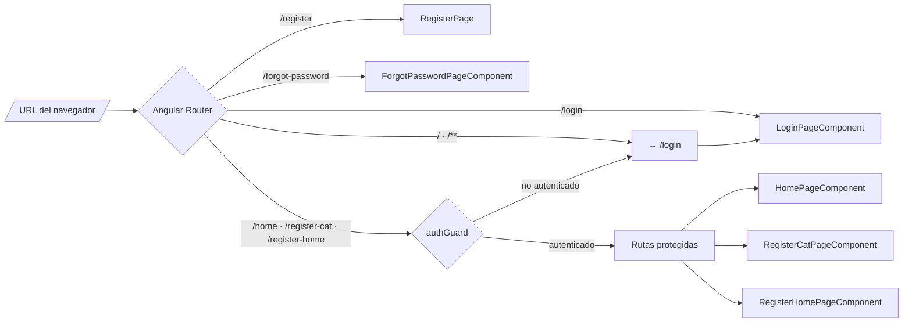
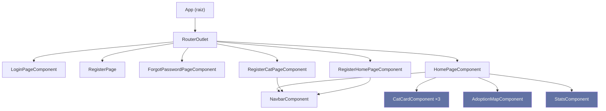
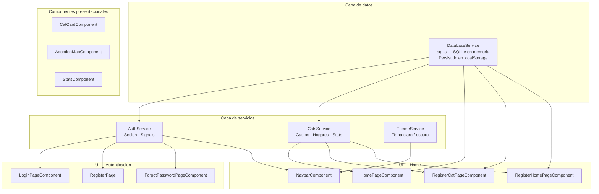
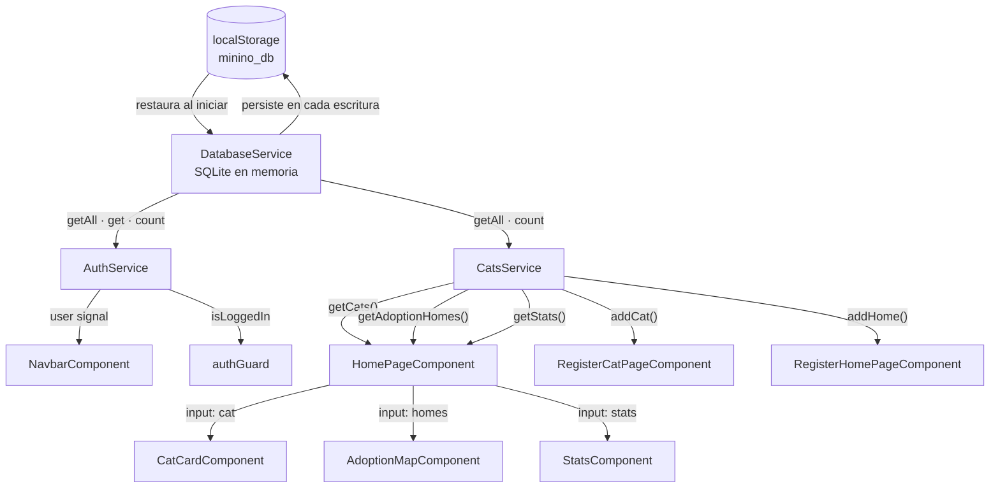
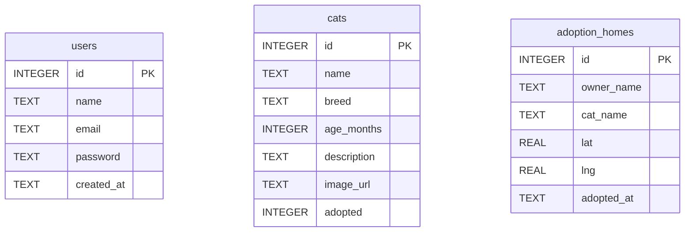

# Minino - Plataforma de Adopcion de Gatitos

Aplicacion web para la gestion de adopciones de gatitos. Permite visualizar gatitos disponibles, registrar hogares adoptivos y consultar estadisticas de adopcion.

## Tecnologias

| Tecnologia | Version | Uso |
|---|---|---|
| Angular | 21.1.0 | Framework principal (standalone components) |
| TypeScript | 5.9.2 | Lenguaje |
| Tailwind CSS | 4.1.12 | Estilos (tema Dracula) |
| sql.js | 1.13.0 | Base de datos SQLite en el navegador |
| Leaflet | 1.9.4 | Mapas interactivos (OpenStreetMap) |
| Vitest | 4.0.8 | Testing |

## Requisitos previos

- Node.js >= 18
- npm >= 10

## Instalacion

```bash
git clone <repo-url>
cd Minino
npm install
```

## Ejecucion

```bash
# Desarrollo
ng serve

# Build de produccion
ng build
```

La aplicacion estara disponible en `http://localhost:4200`.

## Estructura del proyecto

```
src/app/
├── auth/                              # Modulo de autenticacion
│   ├── guards/
│   │   └── auth.guard.ts              # Guard funcional (protege rutas)
│   ├── pages/
│   │   ├── login-page/                # Inicio de sesion
│   │   ├── register-page/             # Registro de usuario
│   │   └── forgot-password-page/      # Recuperacion de contrasena
│   └── services/
│       ├── auth.service.ts            # Estado de sesion y operaciones de auth
│       └── database.service.ts        # Gestion de SQLite (sql.js)
│
├── home/                              # Modulo principal
│   ├── pages/
│   │   ├── home-page/                 # Pagina principal con carrusel y mapa
│   │   ├── navbar/                    # Barra de navegacion responsive
│   │   ├── cat-card/                  # Tarjeta de gatito
│   │   ├── adoption-map/             # Mapa Leaflet de hogares adoptivos
│   │   ├── stats/                     # Panel de estadisticas
│   │   └── register-home-page/        # Registro de hogares adoptivos
│   └── services/
│       └── cats.service.ts            # CRUD de gatitos y hogares
│
├── shared/                            # Componentes compartidos
├── utils/images/                      # Imagenes fuente de gatitos
├── app.ts                             # Componente raiz
├── app.routes.ts                      # Configuracion de rutas
└── app.config.ts                      # Configuracion de Angular
```

## Rutas

| Ruta | Componente | Guard | Descripcion |
|---|---|---|---|
| `/login` | LoginPageComponent | - | Inicio de sesion |
| `/register` | RegisterPage | - | Registro de usuario |
| `/forgot-password` | ForgotPasswordPageComponent | - | Recuperar contrasena |
| `/home` | HomePageComponent | authGuard | Pagina principal |
| `/register-home` | RegisterHomePageComponent | authGuard | Registrar hogar adoptivo |

Todas las rutas usan lazy loading. Las rutas `/**` y `/` redirigen a `/login`.

## Base de datos

La aplicacion usa SQLite en el navegador mediante sql.js. La base de datos se persiste en `localStorage` con la clave `minino_db`.

### Tablas

**users**

| Columna | Tipo | Restriccion |
|---|---|---|
| id | INTEGER | PRIMARY KEY AUTOINCREMENT |
| name | TEXT | NOT NULL |
| email | TEXT | NOT NULL UNIQUE |
| password | TEXT | NOT NULL |
| created_at | TEXT | DEFAULT datetime('now') |

**cats**

| Columna | Tipo | Restriccion |
|---|---|---|
| id | INTEGER | PRIMARY KEY AUTOINCREMENT |
| name | TEXT | NOT NULL |
| breed | TEXT | NOT NULL |
| age_months | INTEGER | NOT NULL |
| description | TEXT | NOT NULL |
| image_url | TEXT | NOT NULL |
| adopted | INTEGER | DEFAULT 0 |

**adoption_homes**

| Columna | Tipo | Restriccion |
|---|---|---|
| id | INTEGER | PRIMARY KEY AUTOINCREMENT |
| owner_name | TEXT | NOT NULL |
| cat_name | TEXT | NOT NULL |
| lat | REAL | NOT NULL |
| lng | REAL | NOT NULL |
| adopted_at | TEXT | DEFAULT datetime('now') |

### Datos iniciales (seed)

Al iniciar por primera vez, se insertan automaticamente:

- **10 gatitos**: Luna, Milo, Canela, Simba, Nina, Felix, Cleo, Tomas, Mia, Pancho
- **6 hogares adoptivos** ubicados en el Canton Mejia, Ecuador: Machachi, Aloasi, Tambillo, El Chaupi, Cutuglagua, Uyumbicho

## Componentes

### Autenticacion

- **LoginPageComponent**: Formulario con email y contrasena. Validacion reactiva en tiempo real. Redirige a `/home` tras login exitoso.
- **RegisterPage**: Formulario con nombre, email, contrasena y confirmacion. Validador personalizado para verificar que las contrasenas coincidan.
- **ForgotPasswordPageComponent**: Formulario de email para recuperar contrasena. Siempre retorna exito para evitar enumeracion de emails.

### Pagina principal

- **HomePageComponent**: Layout con dos secciones:
  - **Carrusel de gatitos**: Muestra 3 cards simultaneas (la central mas grande). Navegacion con botones anterior/siguiente e indicadores de puntos. En mobile solo se ve la card central.
  - **Mapa y estadisticas**: Mapa Leaflet con markers de hogares adoptivos y panel de 4 estadisticas (total, adoptados, en espera, hogares).

- **NavbarComponent**: Barra de navegacion con el nombre de la app, enlace a registrar hogar, nombre del usuario y boton de cerrar sesion. En mobile muestra menu hamburguesa.

- **CatCardComponent**: Tarjeta con imagen, nombre, raza, edad formateada y descripcion del gatito.

- **AdoptionMapComponent**: Mapa interactivo Leaflet centrado en Canton Mejia. Muestra markers con popups que indican el nombre del gato y su adoptante. Se inicializa fuera de la zona de Angular para mejor rendimiento.

- **StatsComponent**: Grid 2x2 con tarjetas de estadisticas coloreadas (purpura, verde, naranja, cyan).

- **RegisterHomePageComponent**: Formulario para registrar un nuevo hogar adoptivo. Incluye campos de texto (nombre del dueno y del gato) y un mapa interactivo donde se hace click para seleccionar la ubicacion. Tras guardar muestra confirmacion con opcion de registrar otro.

## Servicios

### AuthService

Maneja el estado de autenticacion mediante Angular Signals.

```typescript
// Estado reactivo
readonly user: Signal<User | null>       // Usuario actual
readonly isLoggedIn: Signal<boolean>     // Computed: hay sesion activa

// Operaciones
register(name, email, password)          // Crear cuenta
login(email, password)                   // Iniciar sesion
forgotPassword(email)                    // Recuperar contrasena
logout()                                 // Cerrar sesion
```

Persiste la sesion en `localStorage` con la clave `minino_user`.

### DatabaseService

Abstraccion sobre sql.js para operaciones SQLite.

```typescript
whenReady(): Promise<void>               // Esperar inicializacion
run(sql, params?)                        // INSERT/UPDATE/DELETE
get(sql, params?): any                   // SELECT una fila
getAll(sql, params?): any[]              // SELECT multiples filas
count(sql, params?): number              // COUNT
```

### CatsService

Operaciones de datos sobre gatitos y hogares.

```typescript
getCats(): Cat[]                         // Gatitos no adoptados
getAdoptionHomes(): AdoptionHome[]       // Hogares registrados
addHome(owner, cat, lat, lng)            // Registrar hogar
getStats(): AdoptionStats                // Estadisticas de adopcion
```

## Diseno responsive

La aplicacion es responsive y se adapta a tres breakpoints:

| Breakpoint | Ancho minimo | Dispositivo |
|---|---|---|
| base | 0px | Celulares |
| `sm:` | 640px | Celulares grandes / tablets pequenas |
| `md:` | 768px | Tablets |
| `lg:` | 1024px | Desktop |

### Adaptaciones por pantalla

- **Navbar**: Menu completo en desktop, hamburguesa en mobile
- **Carrusel**: 3 cards en tablet/desktop, 1 card en mobile
- **Mapa + Stats**: Lado a lado en desktop (60/40), apilados en mobile
- **Formularios**: Cards mas compactas en mobile, mas amplias en desktop
- **Inputs**: Padding y tamano de texto ajustados por breakpoint

## Tema visual

La aplicacion usa el tema de colores **Dracula** implementado como variables CSS de Tailwind:

| Variable | Color | Uso |
|---|---|---|
| `dracula-bg` | `#282a36` | Fondo principal |
| `dracula-current` | `#44475a` | Fondo secundario / cards |
| `dracula-fg` | `#f8f8f2` | Texto principal |
| `dracula-comment` | `#6272a4` | Texto secundario |
| `dracula-purple` | `#bd93f9` | Color primario / titulos |
| `dracula-pink` | `#ff79c6` | Hover / acentos |
| `dracula-cyan` | `#8be9fd` | Enlaces |
| `dracula-green` | `#50fa7b` | Exito / confirmaciones |
| `dracula-red` | `#ff5555` | Errores / eliminar |
| `dracula-orange` | `#ffb86c` | Advertencias |
| `dracula-yellow` | `#f1fa8c` | Resaltado |

El fondo de la aplicacion incluye un patron de la silueta de un gatito dibujado con lineas SVG en color purpura con baja opacidad.

## Arquitectura

- **Standalone components**: Todos los componentes usan `standalone: true` (sin NgModules)
- **Lazy loading**: Todas las rutas cargan componentes de forma diferida
- **Signals**: Estado reactivo con Angular Signals y computed values
- **OnPush**: Todas las vistas usan `ChangeDetectionStrategy.OnPush`
- **Client-side only**: No hay backend; todos los datos viven en el navegador
- **Persistencia**: localStorage para base de datos y sesion de usuario

---

### Flujo de navegacion



---

### Jerarquia de componentes



---

### Capas de la aplicacion y dependencias de servicios



---

### Flujo de datos



---

### Esquema de base de datos



## Testing

```bash
ng test
```

Usa Vitest como test runner.
